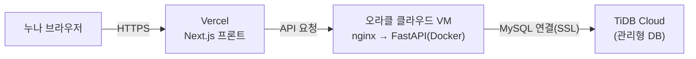

# 배포 가이드 — 오라클 클라우드(백엔드) + TiDB Cloud(DB) + Vercel(프론트)

## 전체 그림

- **프론트(Next.js)** → Vercel (무료, 자동 배포)
- **백엔드(FastAPI)** → 오라클 클라우드 Always Free VM (Docker로 실행)
- **DB** → TiDB Cloud (MySQL 호환, 관리형) — 서버에 직접 DB를 안 띄워서 관리가 편해요
- 로컬 개발은 내 컴퓨터의 MySQL 사용 (TiDB와 같은 MySQL 방언이라 방언 차이 걱정 없음)

---

## 1단계 — 오라클 클라우드 계정 + 서버 만들기 (누나가 직접!)

이 단계는 로그인/결제 정보가 필요해서 제가 대신 할 수 없어요. 아래 순서대로 해주세요.

1. **[oracle.com/cloud/free](https://www.oracle.com/cloud/free/)** 에서 계정 가입
   - 이메일 인증 필요
   - 신용카드 등록을 요구하지만 **Always Free 항목은 과금되지 않아요** (본인 확인용)
2. 로그인 후 왼쪽 메뉴 **Compute → Instances → Create Instance**
3. 인스턴스 만들 때 이렇게 설정:
   - **Image**: Ubuntu 22.04 (또는 24.04)
   - **Shape**: `Edit` 눌러서 **"Ampere" (VM.Standard.A1.Flex)** 선택 → Always Free 자격 — OCPU 2개, 메모리 12GB 정도로 설정 (무료 한도 안)
   - **SSH Keys**: "Generate a key pair for me" 선택 후 **Private Key 다운로드** (파일 이름 예: `ssh-key.key`) — 이거 없으면 서버에 못 들어가요!
4. **Create** 클릭 → 몇 분 뒤 인스턴스가 "Running" 상태가 돼요
5. 인스턴스 상세 페이지에서 **Public IP Address** 복사해두기
6. **네트워크 포트 열기** (기본은 SSH만 열려있어요):
   - 인스턴스 상세 → 하위의 **Subnet** 클릭 → **Security Lists** → 기본 보안 목록 클릭
   - **Add Ingress Rules** 로 아래 2개 추가:
     - Source CIDR `0.0.0.0/0`, IP Protocol TCP, Destination Port `80` (웹 접속용)
     - Source CIDR `0.0.0.0/0`, IP Protocol TCP, Destination Port `443` (나중에 https용)

**여기까지 하시면 저한테 알려주세요:**
- Public IP 주소
- 다운로드한 SSH 키 파일 경로 (예: `~/Downloads/ssh-key.key`)

그러면 제가 SSH로 들어가서 Docker 설치부터 배포까지 전부 진행할게요.

---

## 2단계 — 서버 세팅 (제가 SSH로 진행할 것들)

*(누나가 접속 정보 주시면 자동으로 처리)*

- [ ] Docker, Docker Compose, nginx 설치
- [ ] 이 저장소를 서버로 clone
- [ ] `backend/.env` 에 실제 값 채우기:
      - `DATABASE_URL` = TiDB Cloud 연결 문자열 (TiDB 콘솔 → Connect, mysql+pymysql 형식 + SSL 옵션)
      - `GOOGLE_CLIENT_ID`, `JWT_SECRET`, `FRONTEND_URL`
- [ ] `docker compose up -d --build` 로 백엔드 실행 (DB는 TiDB Cloud라 컨테이너 없음)
- [ ] nginx 설정 적용 (`deploy/nginx.conf` 참고) → 80번 포트로 API 노출
- [ ] `curl http://<서버IP>/health` 로 정상 동작 확인

> DB(TiDB Cloud)는 이미 만들어져 있으니, 서버에서는 백엔드만 띄우고 `DATABASE_URL`로 연결만 하면 돼요.
> 테이블은 FastAPI가 처음 뜰 때 자동으로 만들어요 (`Base.metadata.create_all`).

## 3단계 — Vercel에 프론트 배포

1. **[vercel.com](https://vercel.com)** 에 GitHub 계정으로 로그인 (누나가 직접)
2. **Add New → Project** → `HANJIYEONN/headache-log` 저장소 선택
3. **Root Directory**를 `frontend` 로 지정 (모노레포라 꼭 필요!)
4. **Environment Variables**에 추가:
   - `NEXT_PUBLIC_API_URL` = `http://<오라클 서버 IP>` (2단계 끝나고 나온 주소)
   - `NEXT_PUBLIC_GOOGLE_CLIENT_ID` = (기존 `.env.local`에 있는 값과 동일)
5. **Deploy** 클릭 → 몇 분 뒤 `https://headache-log-xxxx.vercel.app` 같은 주소 생성

## 4단계 — Google Cloud Console에 배포 주소 등록

Google 로그인이 배포 주소에서도 되려면, OAuth 클라이언트 설정에 새 주소를 추가해야 해요:

1. [Google Cloud Console](https://console.cloud.google.com) → API 및 서비스 → 사용자 인증 정보
2. 기존 OAuth 클라이언트 ID 클릭
3. **승인된 자바스크립트 원본**에 추가:
   - Vercel 주소 (예: `https://headache-log-xxxx.vercel.app`)
4. **저장**

## 5단계 — 최종 확인

- [ ] Vercel 주소로 접속 → 로그인 페이지 뜨는지
- [ ] 구글 로그인 성공하는지
- [ ] 기록 저장/조회/수정/삭제가 실제로 되는지

---

## 참고: 로컬 개발은 그대로 유지돼요

배포 설정은 전부 환경변수(`NEXT_PUBLIC_API_URL`, `FRONTEND_URL`)로 분리해놔서, 로컬에서 `npm run dev` / `uvicorn`으로 개발할 땐 지금처럼 `localhost`로 자동 동작해요.
