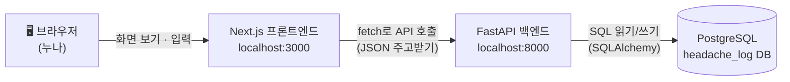
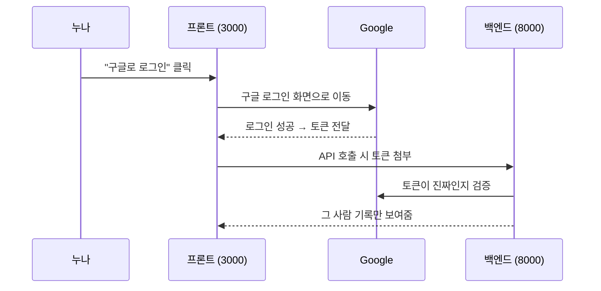

# 설계 문서 — 두통 기록 차트 🩷

> 이 문서는 프로젝트의 "지도"예요. 코드가 어떻게 굴러가는지 길을 잃으면 여기로 돌아오세요!

## 1. 전체 구조 (아키텍처)



**역할 분담** — 식당에 비유하면:
| 부분 | 역할 | 비유 |
|---|---|---|
| 프론트엔드 (Next.js) | 화면을 그리고 입력을 받음 | 홀 직원 🙋 |
| 백엔드 (FastAPI) | 요청을 검사하고 처리 | 주방장 👨‍🍳 |
| DB (PostgreSQL) | 데이터를 안전하게 보관 | 냉장고/창고 🗄️ |

## 2. 폴더 구조

```
workSpace/
├── frontend/                  # Next.js (React + TypeScript + Tailwind)
│   └── src/
│       ├── app/
│       │   ├── page.tsx       # 메인 화면 (/)
│       │   └── layout.tsx     # 모든 페이지의 공통 틀
│       ├── components/
│       │   └── EntryForm.tsx  # 기록 입력 폼
│       └── lib/
│           └── api.ts         # 백엔드 호출 함수 모음
├── backend/                   # FastAPI (Python)
│   └── app/
│       ├── main.py            # 서버 시작점 (CORS, 라우터 등록)
│       ├── database.py        # DB 연결 설정
│       ├── models.py          # DB 테이블 정의 (SQLAlchemy)
│       ├── schemas.py         # 요청/응답 데이터 모양 (Pydantic)
│       └── routers/
│           └── entries.py     # /entries API (CRUD)
├── README.md                  # 프로젝트 소개
├── TODO.md                    # 작업 진행 상황
└── DESIGN.md                  # 이 문서!
```

## 3. DB 설계

테이블 하나로 시작해요: `headache_entries`

| 컬럼 | 타입 | 의미 | 비고 |
|---|---|---|---|
| `id` | integer | 고유 번호 | DB가 자동 부여 (PK) |
| `entry_date` | date | 날짜 | 필수 |
| `menstruating` | boolean | 생리기간 유무 | 기본 false |
| `took_painkiller` | boolean | 통증약 복용여부 | 항상 true (통증약은 늘 복용) |
| `effective` | boolean | 효과여부 | 약 안 먹으면 비움(null) |
| `dose_count` | integer | 복용횟수 | null 허용 |
| `trigger` | text | 촉발요인 | 자유 입력 |
| `bp_systolic` | integer | 혈압-수축기 | null 허용 |
| `bp_diastolic` | integer | 혈압-이완기 | null 허용 |
| `bp_pulse` | integer | 혈압-맥박수 | null 허용 |
| `user_email` | varchar | 기록 주인 | Google 로그인 붙일 때 사용 예정 |

> 💡 **null이란?** "값이 아직 없음"이라는 뜻이에요. 약을 안 먹은 날은 효과여부를 물을 수 없으니 비워두는 거죠.

## 4. API 설계

백엔드가 제공하는 창구 목록이에요. (Swagger 문서: http://localhost:8000/docs)

| 메서드 | 주소 | 하는 일 |
|---|---|---|
| GET | `/entries` | 기록 전체 목록 (최신순) |
| POST | `/entries` | 새 기록 저장 |
| GET | `/entries/{id}` | 기록 하나 조회 |
| PUT | `/entries/{id}` | 기록 수정 |
| DELETE | `/entries/{id}` | 기록 삭제 |
| GET | `/health` | 서버 살아있는지 확인 |

**데이터가 오가는 모양 (JSON)**:
```json
{
  "entry_date": "2026-07-14",
  "menstruating": false,
  "took_painkiller": true,
  "effective": true,
  "dose_count": 1,
  "trigger": "수면 부족",
  "bp_systolic": 115,
  "bp_diastolic": 74,
  "bp_pulse": 80
}
```

## 5. 화면 설계

```
┌──────────────────────────────┐
│  🩷 두통 기록 차트            │
├──────────────────────────────┤
│  [ 오늘의 두통 기록 폼 ✏️ ]   │  ← 완성! ✅
├──────────────────────────────┤
│  [목록📋] [달력🗓️] [차트📊]  │  ← 3탭 (다음 작업)
│                              │
│   선택한 탭의 내용 표시       │
└──────────────────────────────┘
```

| 탭 | 내용 | 상태 |
|---|---|---|
| 목록 | 테이블 형태, 최신순 정렬, 삭제 버튼 | 간단 버전 완성 → 테이블로 업그레이드 예정 |
| 달력 | 두통 있던 날 표시, 날짜 클릭 시 상세 | 예정 |
| 차트 | 월별 빈도, 약 효과율, 촉발요인 분포 | 예정 |

## 6. 인증 설계 (예정)

Google 로그인만 지원해요.



- 준비물: Google Cloud Console에서 **OAuth 클라이언트 ID** 발급 (누나가 하면 제가 안내할게요!)
- 발급받은 값은 `backend/.env`에 저장 (git에 올라가지 않아요 — 비밀이니까! 🤫)

## 7. 정해진 규칙들

- **기록 항목 9개는 확정**: 날짜, 생리기간, 통증약 복용여부, 효과여부, 복용횟수, 촉발요인, 혈압 3종
- **폼 규칙**: 통증약은 항상 복용 → 복용횟수 필수 입력 / 혈압은 "혈압도 기록하기" 체크 시에만 입력 (2026-07-14 변경)
- 화면은 **3탭** (목록/달력/차트)
- 진행 상황은 `TODO.md`에 기록하고 작업 단위마다 커밋
- 코드에는 배우기 좋게 한글 주석 달기
