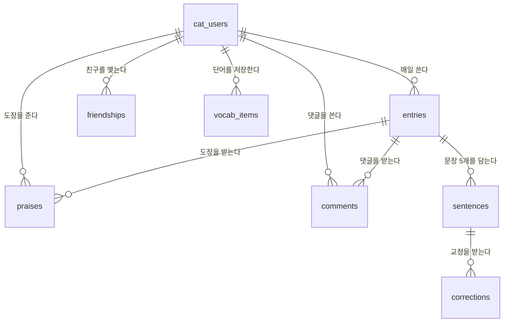

# 🗂️ 고양이 수첩 — DB 설계 (ERD)

| 문서 정보 | 내용 |
|---|---|
| 버전 | v0.1 (초안) |
| 작성일 | 2026-08-02 |
| 기준 | 요구사항 정의서 v0.3, 결정 D-01~D-11 |
| DB | MySQL (로컬) / TiDB Cloud (배포) — 두통 기록과 같은 서버 |

---

## 1. 테이블 한눈에 보기

```
cat_users (사용자)
   │
   ├── entries (하루치 수첩)  ──── sentences (문장 1~5)
   │                          └─── corrections (교정 내용)
   │
   ├── friendships (친구 관계)
   ├── praises (칭찬도장)
   ├── comments (댓글)
   └── vocab_items (단어장 — 어른 모드)
```

### 관계 그림 (mermaid)



---

## 2. 테이블 상세

### 2.1 `cat_users` — 고양이 수첩 사용자

구글 로그인한 사람이 고양이 수첩에 처음 들어와 역할을 고르면 한 줄이 생겨요.
**비밀번호 칸이 없어요** — 로그인은 구글이 처리하니까요 (D-02).

| 컬럼 | 타입 | 설명 |
|---|---|---|
| `id` | BIGINT PK | 자동 번호 |
| `user_id` | BIGINT FK → 기존 `users.id` | 두통 기록에서 쓰는 구글 사용자 테이블과 연결 |
| `note_id` | VARCHAR(15) UNIQUE | 수첩 아이디. 영문+숫자 4~15자, **소문자로 변환해 저장** (D-10) |
| `role` | ENUM('child','adult') | 아이 / 어른. **한 번 정하면 못 바꿈** (D-09) |
| `nickname` | VARCHAR(20) | 별명. 어린이 8자 / 어른 20자 |
| `bio` | VARCHAR(100) NULL | 나를 소개하는 한 문장 |
| `avatar` | VARCHAR(20) | 아바타 종류 (cat/dog/dino/rabbit/photo) |
| `avatar_url` | VARCHAR(255) NULL | 사진을 올렸을 때만 |
| `learning_language` | CHAR(2) | 배우는 언어 (ko/en/ja/zh) |
| `feedback_language` | CHAR(2) NULL | 문법 설명을 받을 언어 (어른 모드) |
| `level` | VARCHAR(20) NULL | 초급1/중급1 등 (어른 모드) |
| `daily_reminder` | BOOLEAN | 매일 알림 켜기 (기본 false) |
| `created_at` | DATETIME | 만든 시각 |

> 💡 **왜 기존 `users`와 나눴나요?** 두통 기록만 쓰는 사람도 있으니까요. 고양이 수첩에 들어온 사람만 이 테이블에 줄이 생겨요.

---

### 2.2 `entries` — 하루치 수첩

하루에 한 줄. "오늘 5문장 다 썼나?"를 여기서 관리해요.

| 컬럼 | 타입 | 설명 |
|---|---|---|
| `id` | BIGINT PK | |
| `cat_user_id` | BIGINT FK → cat_users | 누구의 수첩인지 |
| `entry_date` | DATE | 며칠 것인지 |
| `is_complete` | BOOLEAN | 5문장 다 썼는지 |
| `completed_at` | DATETIME NULL | 완성한 시각 |
| `accuracy` | TINYINT NULL | 정확도 % — **교정 없는 문장 수 ÷ 5 × 100** (D-11, 어른 모드) |
| `created_at` | DATETIME | |

**UNIQUE (cat_user_id, entry_date)** — 한 사람이 같은 날짜에 수첩을 두 개 만들 수 없게!

---

### 2.3 `sentences` — 문장

| 컬럼 | 타입 | 설명 |
|---|---|---|
| `id` | BIGINT PK | |
| `entry_id` | BIGINT FK → entries | 어느 날 수첩인지 |
| `position` | TINYINT | 몇 번째 문장인지 (1~5) |
| `original_text` | TEXT | 아이가 **원래 쓴 그대로** (절대 덮어쓰지 않아요) |
| `corrected_text` | TEXT NULL | AI가 고친 문장 (교정이 없으면 NULL) |
| `input_method` | ENUM('keyboard','voice') | ✏️ 글로 썼는지 🎤 말로 썼는지 |
| `created_at` | DATETIME | |

**UNIQUE (entry_id, position)** — 세 번째 문장이 두 개일 수 없게!

> 💡 **원본을 남기는 이유**: 시안에 "✏️글로 썼어요 / 🎤말로 썼어요" 표시가 있고, 어린이 모드는 "고쳤어요" 태그를 보여줘요. 원본이 없으면 뭘 고쳤는지 보여줄 수 없어요. (NF-06 "아이가 쓴 글은 유실되면 안 됨")

---

### 2.4 `corrections` — 교정 내용

문장 하나에 틀린 곳이 여러 개일 수 있어서 따로 뺐어요.

| 컬럼 | 타입 | 설명 |
|---|---|---|
| `id` | BIGINT PK | |
| `sentence_id` | BIGINT FK → sentences | |
| `wrong_text` | VARCHAR(100) | 틀린 부분 ("조아요") |
| `right_text` | VARCHAR(100) | 고친 것 ("좋아요") |
| `note` | TEXT NULL | 문법 노트 (어른 모드에서만 자세히) |
| `pronunciation` | VARCHAR(100) NULL | 발음 표기 ("[조아요]") |
| `created_at` | DATETIME | |

---

### 2.5 `friendships` — 친구 관계

| 컬럼 | 타입 | 설명 |
|---|---|---|
| `id` | BIGINT PK | |
| `requester_id` | BIGINT FK → cat_users | 신청한 사람 |
| `receiver_id` | BIGINT FK → cat_users | 받은 사람 |
| `status` | ENUM('pending','accepted') | 대기 / 수락됨 |
| `created_at` | DATETIME | |

**UNIQUE (requester_id, receiver_id)** — 같은 사람에게 두 번 신청 못 하게

> ⚠️ 역할(아이/어른) 제한은 두지 않기로 했어요 (D-08). 나중에 막고 싶으면 친구 신청 API에 `role` 비교 한 줄만 추가하면 돼요.

---

### 2.6 `praises` — 칭찬도장 💛

| 컬럼 | 타입 | 설명 |
|---|---|---|
| `id` | BIGINT PK | |
| `entry_id` | BIGINT FK → entries | 어느 수첩에 준 도장인지 |
| `giver_id` | BIGINT FK → cat_users | 누가 줬는지 |
| `created_at` | DATETIME | |

**UNIQUE (entry_id, giver_id)** — 한 수첩에 한 사람이 도장 하나만

---

### 2.7 `comments` — 댓글 💬

| 컬럼 | 타입 | 설명 |
|---|---|---|
| `id` | BIGINT PK | |
| `entry_id` | BIGINT FK → entries | |
| `writer_id` | BIGINT FK → cat_users | |
| `content` | VARCHAR(200) | 댓글 내용 |
| `created_at` | DATETIME | |

> 비속어 필터는 2차 (D-07). 그때 `is_filtered` 같은 칸을 추가하면 돼요.

---

### 2.8 `vocab_items` — 단어장 (어른 모드)

| 컬럼 | 타입 | 설명 |
|---|---|---|
| `id` | BIGINT PK | |
| `cat_user_id` | BIGINT FK → cat_users | |
| `correction_id` | BIGINT FK → corrections NULL | 어느 교정에서 저장했는지 |
| `expression` | VARCHAR(100) | 배운 표현 ("좋아요") |
| `meaning` | VARCHAR(200) NULL | 뜻·설명 |
| `created_at` | DATETIME | |

---

## 3. AI는 언제 부르나요? (비용과 직결돼요 💰)

**AI는 문장을 고칠 때 딱 한 번만 부르고, 결과는 DB에 저장해요.** 같은 문장을 다시 볼 때는 저장된 걸 읽기만 하니까 AI를 또 부르지 않아요.

```
문장 작성 → AI 호출 1번 → corrections 테이블 + entries.accuracy 에 저장 → 끝
                                    ↑ 이후 화면 표시는 전부 저장된 값 읽기
```

| 언제 | 어린이 모드 | 어른 모드 |
|---|---|---|
| AI 호출 시점 | 5문장 다 쓰고 "다 썼어요!" 누를 때 **1번** | 문장마다 "문장 확인" 누를 때 (하루 최대 **5번**) |

> 💡 어른 모드가 문장마다 부르는 이유는 시안 4a에 "문장 확인" 버튼이 문장별로 있어서예요. 비용이 5배라, 나중에 줄이고 싶으면 "모아서 한 번"으로 바꿀 수 있어요.

## 4. 저장하는 값 vs 세는 값

**저장하는 값** — 한 번 계산해두고 계속 꺼내 씁니다.

| 값 | 어디에 | 언제 계산 |
|---|---|---|
| 교정 내용 (틀린 곳·문법 노트) | `corrections` | AI 호출 직후 |
| 오늘 정확도 (80%) | `entries.accuracy` | 5문장 완성될 때 한 번 |

**세는 값** — 칸에 넣어두지 않고 필요할 때 DB가 세요. **AI와 무관한 단순 산수**라 빠르고 공짜예요.

| 화면에 보이는 것 | 어떻게 구하나 |
|---|---|
| 🔥 연속 기록 (7일) | `entries`에서 `is_complete=true`인 날짜를 최근부터 세기 |
| 🐾 모은 발도장 (32개) | 완성한 `entries` 개수 (`COUNT`) |
| 💛 받은 칭찬도장 | `praises` 개수 |
| 📊 주간 정확도 (▲6%) | **저장된** `entries.accuracy` 들의 평균 (이번 주 − 지난주) |
| 📈 배운 표현 (124개) | `vocab_items` 개수 |

> 💡 **왜 개수를 칸에 안 넣나요?** "발도장 32개"를 칸에 저장해두면, 기록을 지우거나 오류가 났을 때 실제 개수와 어긋나요. 세는 건 0.001초면 끝나서 저장할 이유가 없어요.

---

## 5. 아직 정할 것

- [ ] 기존 `headache_log` DB에 테이블을 추가할지, `cat_note` DB를 새로 만들지
- [ ] 하루가 바뀌는 기준 시각 (밤 12시? 새벽 4시?) → 서비스 정책 정의서에서
- [ ] 친구 수 제한을 둘지 (두면 `friendships`에 개수 검사 필요)
